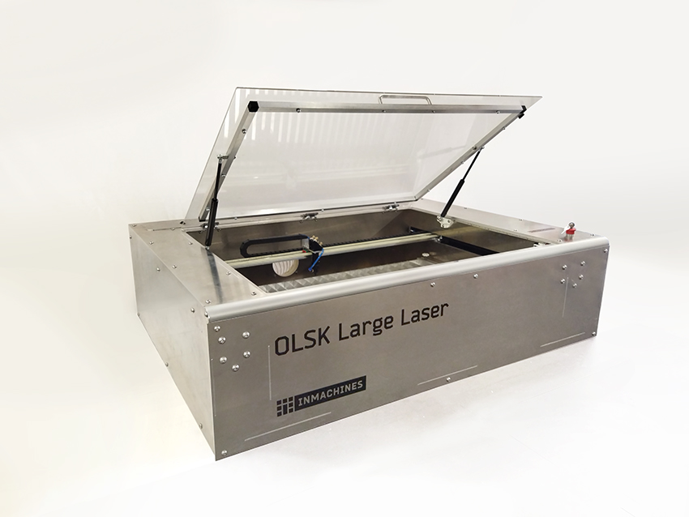

<h1 style=align="center">OLSK Large Laser V1</h1>

<i>Open Source Laser Cutter - Large version - Open Lab Starter Kit</i>

 

Introduction
--

The OLSK Large Laser V1 is a powerful 75W CO2 laser cutter with large cutting area of 1000 x 700 mm. It can move at a high speed and precision of 0.05mm. With an innovative slim design (1520 x 1120 x 400 mm W x D x H), it is build with a full aluminum and an isolated cutting chamber, separated from the mechanics, electronics and laser optics. It includes a coaxial laser pointer and homing with inductive sensors. As an open source machine, it can be replicable in most Fab Labs and also industrially. The building have been simplified, compared to its predecessor Fabulaser Mini V2, with reduced number of parts and easier assembly process and laser calibration.

Specifications V1
--

- laser source: 75W CO2
- cutting area: 1000 x 700 mm
- precision: 0.05 mm
- max. cutting thickness:
    - 25 mm wood
- frame and housing: 3 and 4mm CNC milled aluminum plates
- motion: HTD 5M belts
- max speed: 1000mm/s
- bed: aluminum lamella
- guides: 15mm linear rail, 25mm linear shafts
- motors: stepper motors NEMA 24
- machine dimensions: 1520 x 1120 x 400 mm (WxDxH)
- with coaxial laser pointer

Files
--

- **[CAD](cad)**

Author
--

OLSK Large Laser has been designed and built by **[InMachines Ingrassia GmbH](https://www.inmachines.net/)**.

 
Machine design:
- **[Daniele Ingrassia](https://www.linkedin.com/in/danieleingrassia/)**

The machine is part of the **[Open Lab Starter Kit (OLSK)](https://www.inmachines.net/open-lab-starter-kit)** group of open source digital fabrication machines.

OLSK is developed by **[InMachines Ingrassia GmbH](https://www.inmachines.net/)** for the **[Dtec project](https://dtecbw.de/home/forschung/hsu/projekt-fabcity)** at **[Fab City Hamburg](https://www.fabcity.hamburg/en/)**.

OLSK Partners:
  

Contact
--

- daniele@inmachines.net
- [https://www.inmachines.net/](https://www.inmachines.net/)

License
--

Hardware design, CAD and PCB files, BOM, settings and other technical or design files are released under the following license:

- CERN Open Hardware Licence Version 2 Weakly Reciprocal - **[CERN-OHL-W](LICENSE_CERN_OHL_W_V2.txt)**

Assembly manual, pictures, videos, presentations, description text and other type of media are released under the following license:

- Creative-Commons-Attribution-ShareAlike 4.0 International - **[CC BY-SA 4.0](LICENSE_CC_BY_SA_4.0.txt)**
